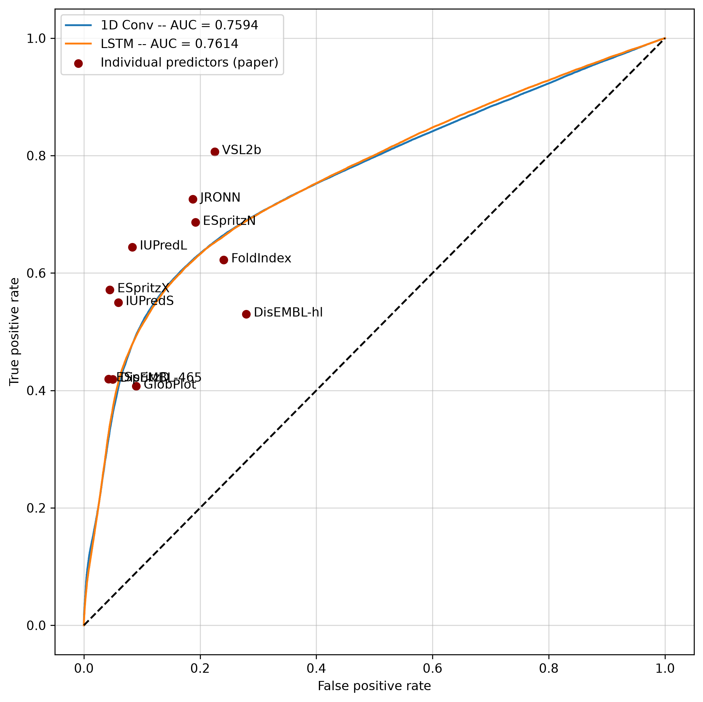

# (Ab initio) Prediction of Intrinsically Disordered Regions in Proteins

Unutrašnje neuređeni proteini, ili unutrašnje poremećeni proteini (eng. *intrinsically disordered proteins*) su proteini kojima nedostaje uređena tercijarna (tj. trodimenzionalna) struktura. Slično, unutrašnje neuređene oblasti predstavljaju komponente unutar proteina bez specifične strukture. Takve oblasti su vrlo prisutne u svakom genomu i imaju ulogu u raznim biološkim procesima.

Trodimenzionalni oblik proteina određen je lancom aminokiselina (eng. *residues*) od kojih se sastoji. Zbog toga postoji veliki broj specijalizovanih predviđačkih modela koji na osnovu sadržaja lanca predviđaju uređene i neuređene delove proteina. 

Na toj ideji zasnovani su i modeli ovog projekta. Ipak, malo se razlikuju od specijalizovanih modela. Specijalizovani modeli, pored niza aminokiselina, uče i na ručno izabranim atributima zasnovanim na domenskom znanju. Sa druge strane, modeli ovog projekta rade sa čistim nizom aminokiselina, bez njihovog apriornog značenja.

Rad [1], koji isprobava tehnike ansambla nad 11 jakih specijalizovanih modela, opisuje statistike ovih modela. Naš cilj je da istreniramo modele koji vrše predviđanja samo na osnovu sekvence, a po performansama pariraju ovim specijalizovanim modelima. 

Jovan Bengin 14/2022

## Terminologija

**Protein** je lanac aminokiselina. Zbog toga, može se predstaviti niskom velikih slova engleske abecede, iz koje će ovaj projekat pokušati da izvuče informaciju o strukturi.

**Aminokiselina** je osnovni gradivni blok proteina. U niski koja opisuje protein, one su predstavljene individualnim karakterima. Postoje 20 standardnih aminokiselina -- one su označene velikim latiničnim slovima iz skupa `ACDEFGHIKLMNPQRSTVWY`. Pored njih, mogu se pojaviti i nestandardne aminokiseline. Na engleskom *residue*.

**Oblast** (ili **regija**) je povezana komponenta unutar proteina koja opisuje strukturnu informaciju. Izvori skupa podataka (navedeni dole) ovu informaciju dele binarno na *uređena* i *neuređena*, mada *neuređena* opisuje razna moguća stanja. Preciznije, *uređena* opisuje oblasti koje su se savile i imaju sekundarnu i tercijarnu strukturu. Klasa *neuređena* obuhvata sve oblasti od onih potpuno neuređenih do onih koje imaju sekundarnu, ali ne i tercijarnu strukturu. Na engleskom *region*.

## Skup podataka

Postoje dva glavna izvora skupa podataka: **DisProt** (https://disprot.org/)[2] i **MobiDB** (https://mobidb.org/)[3]. Oba održava BiocomputingUP Lab Unverziteta u Padovi. 

DisProt skup sastavljen je od ručno proverenih podataka. Zbog toga je vrlo precizan, ali i mali -- sadrži oko 3500 proteina. Takođe, neke proteinske regije nisu testirane, pa u skupu podataka postoje i regije za koje je klasifikacija nepoznata.

MobiDB je, sa druge strane, sastavljen od velikog broja podataka. Nastoji da za svaku regiju svakog proteina iz **UniProt** baze podataka (https://www.uniprot.org/) izvrši predviđanje uređenosti. Predviđanja u MobiDB dele se na četiri kategorije, u redosledu pouzdanosti:

1. Curated — tačne vrednosti iz DisProt.
2. Derived — vrednosti indirektno dobijene eksperimentima rendgenske kristalografije i nuklearne magnetne rezonancije. Iz ova dva eksperimenta možemo, sa dovoljno jakom uverenošću, utvrditi da li je neka oblast uređena ili ne. Zbog toga nam služi kao pouzdana dopuna na podatake prve kategorije.
3. Homology — rezultati predviđeni na osnovu tačnih rezultata sličnih sekvenci.
4. Prediction — rezultati dobijeni raznim predviđačkim modelima.

U ovom projektu pokušaćemo da zaključke izvedemo iz istinitih *(ground truth)* vrednosti, a ne onih predviđenih od strane drugih modela. Prema tome, koristićemo samo MobiDB podatke prve i druge kategorije.

## Modeli

Trenirana su dva modela: 1D Konvolutivna neuronska mreža i LSTM rekurentna neuronska mreža. Ulaz je lanac aminokiselina nad kome je izvršen padding, dok je izlaz vektor iste dužine koji predstavlja predviđene verovatnoće za svaku aminokiselinu.

### 1D Konvolutivna neuronska mreža

Motivacija za korišćenje ove mreže je što može da pokupi kontekst iz susednih pozicija. Model uzima sekvencu fiksne dužine, vrši embedding, nakon čega se primenjuje određen broj konvolutivnih slojeva istog formata:

- Konvolucija
- Batch norm, za stabilizaciju i brže treniranje
- ReLU
- Dropout
    
Nakon toga, vrši se konačna konvolucija koja predstavlja spajanje svih kanala u jedan. 

Optimalan broj konvolutivnih slojeva bira se u rasponu od 1 do 9, na osnovu površine ispod ROC krive na validacionom skupu.

### LSTM rekurentna neuronska mreža

Rekurentna neuronska mreža se prirodno nameće kao izbor zbog svoje efikasnosti sa radom nad sekvencama. Model uzima sekvencu fiksne dužine, vrši embedding, nakon čega se primenjuje dvosmerni jednoslojni LSTM. Nakon toga se, za svaki vremenski trenutak (jer svaki odgovara nekoj aminokiselini) linearnim slojem sva skrivena stanja spajaju u jedno.

## Rezultati

Rad [1] navodi statistike sledećih 11 modela:

| Model | Osetljivost | Specifičnost | Tačnost |
|---|---|---|---|
| DisEMBL-465 | 0.4191 | 0.9503 | 0.7414 |
| DisEMBL-hl | 0.5301 | 0.7206 | 0.6456 |
| ESpritzD | 0.4197 | 0.9574 | 0.7459 |
| ESpritzN | 0.6862 | 0.8081 | 0.7966 |
| ESpritzX | 0.5714 | 0.9553 | 0.8043 |
| FoldIndex | 0.6223 | 0.7593 | 0.7061 |
| GlobPlot | 0.4073 | 0.9100 | 0.6952 |
| IUPredL | 0.6442 | 0.9167 | 0.8056 |
| IUPredS | 0.5496 | 0.9409 | 0.7870 |
| JRONN | 0.7258 | 0.8125 | 0.7789 |
| VSL2b | 0.8067 | 0.7750 | 0.7875 |

Istrenirana su sledeća dva modela:

| Model | Osetljivost | Specifičnost | Tačnost |
|---|---|---|---|
| 1D Conv. Model | 0.5950 | 0.8409 | 0.7353 |
| LSTM Model | 0.5988 | 0.8348 | 0.7335 |

Istrenirani modeli se jedva razlikuju. Površina ispod ROC krive je za oba modela približna $0.76$. Oba su, u odnosu na navedenih 11 modela, negde u sredini. Ovo je solidan rezulat, s obzirom da ti modeli koriste razne druge atribute konstruisane na osnovu domenskog znanja, dok naši koriste samo sekvencu aminokiselina.

Optimalan broj konvolutivnih slojeva ispostavlja se da je $4$, što daje kontekst veličine $61$. Drugim rečima, odluka o uređenosti aminokiselina većinski se zasniva na kontekstu širine oko $60$. Dakle, kontekst definitivno ima uticaj, ali ne preširok kontekst.

Najveća mana naših modela je što su previše rigidni, tj. ne reaguju dovoljno brzo na uređene/neuređene oblasti male dužine. To se u konvolutivnoj neuronskoj mreži može rešiti npr. smanjenjem dilatacije, mada rezulati izbora hiperparametra pokazuju da se gledanjem širokog konteksta zaista postiže bolji rezultat. Dakle, iako ne reaguju na male oblasti, modeli imaju sposobnost da ostaju konzistentni na velikoj, pa time zaista predviđaju velike povezane oblasti, a ne samo nasumične niske nula i jedinica.

Druga mana je što je skup podataka za treniranje bio relativno mali. Zbog toga, modeli su brzo iskonvergirali ka onome što su mogli da nauče. U budućnosti, kada bude otkriveno više uređenih/neuređenih regija, ovi modeli će imati veći skup podataka za treniranje i postaće jači.

## Reference

[1] "Ensemble Prediction of Intrinsically Disordered Regions in Proteins." Attia A. Stanford University, CS229 Final Project Report, 2016. https://cs229.stanford.edu/proj2016/report/Attia-EnsemblePredictionOfIntrinsicallyDisorderedRegionsInProteins-report.pdf

[2] "DisProt in 2026: enhancing intrinsically disordered proteins accessibility, deposition, and annotation"
Nugnes MV, Bouhraoua KEA, Zoubiri M, Pancsa R, Fichó E, DisProt Consortium, Tompa P, Piovesan D, Tosatto SCE and Aspromonte MC (2025) Nucleic Acids Research, Database Issue.

[3] "MobiDB in 2025: Integrating ensemble properties and function annotations for intrinsically disordered proteins"
Piovesan D, Del Conte A, Mehdiabadi M, Aspromonte MC, Blum M, Tesei G, von Bülow S, Lindorff-Larsen K, Tosatto SCE.
(2024) Nucleic Acid Research.

